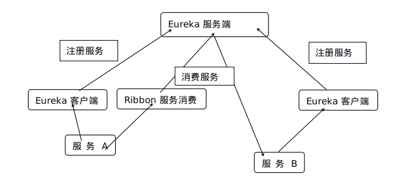

# SpringCloud-Ribbon

用于服务的消费者发现服务和实现客户端负载均衡



## 使用

默认启用ribbon，引入maven后无需额外配置

依赖：

```xml
<dependency>
    <groupId>org.springframework.cloud</groupId>
    <artifactId>spring-cloud-starter-netflix-eureka-client</artifactId>
</dependency>
<dependency>
    <groupId>org.springframework.cloud</groupId>
    <artifactId>spring-cloud-starter-netflix-ribbon</artifactId>
</dependency>
```

配置：

```java
@EnableDiscoveryClient//eureka客户端
@SpringBootApplication
public class CloudRibbonApplication {

    /**
     * RestTemplate是服务发现和客户端负载的实现类
     *
     * @return
     */
    @Bean
    @LoadBalanced//开启负载
    public RestTemplate restTemplate(){
        return new RestTemplate();
    }
}
```

使用：

```java
    @Autowired
    private RestTemplate restTemplate;

    @RequestMapping("/order/{orderId}")
    public String getOrder(@PathVariable Integer orderId){
        //第一个参数是消费服务的URL，域名写服务名，而不是真正的域名
        String result =  restTemplate.getForObject("http://orderserver/order/{1}",String.class,orderId+1);
        result =  restTemplate.getForObject("http://orderserver/order/{1}",String.class,orderId+1);
        return result;
    }
```


## 配置负载算法

yml文件：

```yml
服务名:
	ribbon:
		NFLoadBalancerRuleClassName: com.netflix.loadbalancer.RandomRule
```

为特定的服务配置算法，实现类为com.netflix.loadbalancer包下